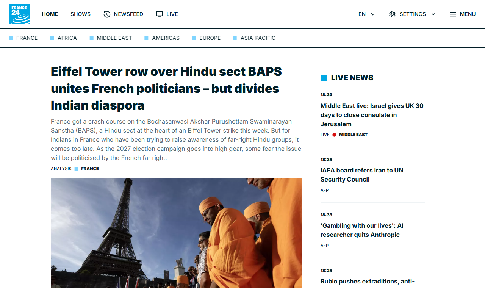

# Screenshotline

**A screenshot API that survives production. URL in, image out.**

[](https://github.com/MAMubeenKhan/screenshotline/actions/workflows/smoke.yml)
[](LICENSE)
[](https://screenshotline.com/?ref=github)

```bash
curl "https://api.screenshotline.com/take?url=https://example.com&block_cookie_banners=true" -o shot.png
```



*Above: france24.com, captured by this API. The consent wall is gone, the empty
ad slot has been collapsed rather than left as a grey hole pushing content below
the fold, and the lazy-loaded hero image has actually loaded. Most screenshot
failures are not crashes — they are a 200 with the wrong picture.*

---

## Two ways to use it

**Hosted** — [screenshotline.com](https://screenshotline.com/?ref=github). Free tier, 500
renders a month, no card. Warm browser pool, cache, and someone else's pager.

**Self-hosted** — `docker compose up -d`. The same renderer, nothing held back.
See [SELF-HOSTING.md](SELF-HOSTING.md), which is honest about what running
headless Chrome at scale actually costs you.

---

## Why this exists

Taking one screenshot with Puppeteer is twenty lines. Taking ten thousand is a
different job, and it is the job people pay to avoid:

| Symptom | Cause | What this does about it |
| --- | --- | --- |
| Memory climbs, container OOM-killed | Chrome does not release memory across navigations — 200MB becomes 1GB+ | Recycles each browser after `MAX_RENDERS_PER_BROWSER` renders |
| `<defunct>` processes, pool slots never free | Chrome crashes mid-render; nothing reaps the orphans when your app is PID 1 | `tini` as PID 1 in the image, `init: true` in compose |
| Crashes on image-heavy pages | Docker gives `/dev/shm` only 64MB | `--disable-dev-shm-usage` plus `shm_size: 1gb` |
| p99 latency spikes to 30s+ | One page with a resource that never loads holds a slot | Hard wall-clock timeout, then **SIGKILL** — not `page.close()`, which waits on the thing that hung |
| First request after idle takes 3–5s | Chromium cold start | Pool warmed at boot, never scaled to zero |
| Full-page captures miss below-fold images | Lazy loading never fired because nothing scrolled | Scrolls the document, waits, returns to top |
| Server dies mid-sweep | A failed browser launch leaves Puppeteer's temp-profile cleanup to throw `EBUSY`, unhandled | Launch retries with backoff; background failures can never exit the process |
| 200 OK with a blank white image | Bot wall, or a challenge script we blocked | Two-signal blank detection, reported in `X-Blank-Suspected` |

Plus the one that is not a performance problem: an endpoint that fetches
arbitrary URLs is an **SSRF engine** by default. Private and reserved ranges
are refused, and every redirect hop is re-checked, not just the submitted URL.

---

## Quick start

**Docker (recommended)**

```bash
docker compose up -d
curl "http://localhost:3000/take?url=https://example.com" -o out.png
```

**Node 22+**

```bash
npm install
npm start          # http://localhost:3000
npm run smoke      # 30 checks against the real render path
```

Open <http://localhost:3000> for a demo with no signup.

---

## API

One endpoint. `GET` or `POST /take`, returning **binary image data** — no JSON
envelope, no second round trip. That is deliberate: the URL has to work
directly inside an ``.

```
GET /take
  ?url=https%3A%2F%2Fexample.com
  &format=webp
  &full_page=true
  &block_cookie_banners=true
  &viewport_width=1440
  &cache=true&cache_ttl=86400
```

### Parameters

| Parameter | Default | Notes |
| --- | --- | --- |
| `url` | *required* | http/https only. Private and reserved addresses refused. |
| `format` | `png` | `png`, `jpeg`, `webp`, `pdf` |
| `quality` | `80` | jpeg/webp only, 1–100 |
| `full_page` | `false` | Scrolls first so lazy images load |
| `selector` | — | Capture one element. Mutually exclusive with `full_page` |
| `viewport_width` / `viewport_height` | `1280` / `800` | |
| `device_scale_factor` | `1` | `2` for retina |
| `block_ads` | `false` | Blocks known ad and analytics hosts |
| `block_cookie_banners` | `false` | Blocks CMP scripts, then sweeps leftover overlays |
| `omit_background` | `false` | Transparent PNG/WebP |
| `color_scheme` | `light` | `light` or `dark` |
| `delay` | `0` | Extra wait in ms before capture |
| `wait_until` | `domcontentloaded` | `load`, `domcontentloaded`, `networkidle0`, `networkidle2` |
| `settle` | `5000` | Budget after navigation for load, network quiet and image decode |
| `timeout` | `30000` | Wall-clock ceiling in ms |
| `ignore_tls_errors` | `false` | Accept expired, self-signed and mismatched certificates |
| `basic_auth` | — | `user:password` for HTTP basic auth |
| `headers` | — | JSON object of extra request headers |
| `fail_on_http_error` | `false` | Return an error instead of an image when the target returns 4xx/5xx |
| `fail_on_blank` | `false` | Return an error instead of a blank image when nothing rendered |
| `cache` / `cache_ttl` | `false` / `86400` | Serve from the store when warm |
| `access_key` | — | Or the `X-Access-Key` header |
| `signature` | — | HMAC. See below. |

### Response headers

| Header | Meaning |
| --- | --- |
| `X-Cache` | `HIT`, `MISS` or `BYPASS` |
| `X-Render-Ms` | Server-side render time |
| `X-Upstream-Status` | HTTP status the target page returned |
| `X-Blocked-Requests` | Requests blocked by the ad/consent filters |
| `X-Wait-Fallback` | `true` if the page never went network-idle and we captured anyway |
| `X-Blank-Suspected` | `true` if the capture looks blank - see below |
| `X-Text-Length` | Characters of visible text found in the page |

### Errors

JSON, with a message that says how to fix it.

```json
{
  "error": {
    "code": "render_timeout",
    "message": "Render exceeded 30000ms. Heavy ad and tracking scripts are the usual cause - try block_ads=true, or a longer timeout (up to 60000)."
  }
}
```

### The silent failure this API tries hard to avoid

A blank white image returned with HTTP 200 is worse than an error: the
customer's pipeline records a success and nobody notices for a month. Bot
walls, blocked challenge scripts and pages that render nothing without
JavaScript all produce exactly that.

Every response therefore carries `X-Blank-Suspected`, decided from two
independent signals - an empty DOM, and encoded bytes-per-pixel far below what
a real screenshot produces. Pass `fail_on_blank=true` to turn it into a 502
instead, and `fail_on_http_error=true` if an upstream 403 should be your
problem rather than a picture of a bot wall.

Measured on the 202-page suite: 7 pages returned a technically successful but
visually empty capture before this existed.

---

## Reading a page instead of photographing it

`GET` or `POST /extract` runs the exact same render — JavaScript executed, the
adaptive settle, consent banners swept, ad slots collapsed, lazy images loaded
— and then reads the DOM as Markdown instead of photographing it.

```
GET /extract?url=https%3A%2F%2Fexample.com
```

```markdown
# Example Domain

This domain is for use in documentation examples without needing permission.

[Learn more](https://iana.org/domains/example)
```

| Parameter | Default | Notes |
| --- | --- | --- |
| `strip_chrome` | `true` | Drop nav, header, footer and sidebars. Falls back to the whole body if stripping would leave nothing. |
| `max_chars` | `0` | Truncate, for a fixed context budget. `0` means no limit. |
| `response` | `markdown` | `json` returns `{url, title, chars, upstream_status, markdown}` instead. |

Everything from `/take` still applies — `block_ads`, `basic_auth`, `headers`,
`settle`, `timeout`, signed URLs, the SSRF guards.

Why this is not just `curl | html2md`: by the time we extract, we are holding a
fully rendered, consent-swept DOM. Two things follow from that which a
server-side HTML parser cannot do.

- **Client-rendered pages work.** A plain fetch of `app.netlify.com` yields
  121 characters of visible text, and they read *"The Netlify dashboard needs
  JavaScript :("*. Rendered first, the same URL extracts the actual login page.
- **Layout disambiguates the text.** `danluu.com` writes
  `<d>09/26</d><a ...>title</a>` with no whitespace between them and styles
  `<d>` as a 4em flex item. Parsed as markup that concatenates to
  `09/26[title]`; read with the computed layout it becomes `09/26 [title]`.

Open shadow roots are walked too, so pages built out of web components extract
as text rather than as nothing. Closed roots are unreachable by design.

---

## MCP server

Agents get both halves of this over the Model Context Protocol: the screenshot
for when the layout is the answer, the Markdown for when the text is.

Hosted, nothing to install — connect by URL with a
[free key](https://screenshotline.com/account?ref=github) (500 renders a month, no card):

```bash
claude mcp add --transport http screenshotline https://api.screenshotline.com/mcp --header "X-Access-Key: sl_live_..."
```

Self-hosting, it runs locally over stdio from a clone, owning a single browser:

```bash
claude mcp add screenshotline -- node /path/to/screenshotline/mcp/server.js
```

Two tools:

| Tool | Returns |
| --- | --- |
| `screenshot` | The rendered image, plus an explicit warning if the capture looks blank rather than a silent empty picture. |
| `read_page` | The page as Markdown. |

Point either one at an instance you already run — with its warm pool, cache
and rate limit — by setting `SCREENSHOTLINE_BASE_URL`, plus
`SCREENSHOTLINE_ACCESS_KEY` if that instance requires a key.

The SSRF guards apply here too. An agent cannot talk this server into scanning
`127.0.0.1` or a cloud metadata endpoint.

---

## Wait strategy

`wait_until` defaults to `domcontentloaded`, not `networkidle2`. That is a
deliberate reversal of the obvious choice, and it came from measurement rather
than taste:

| Strategy | Result on the 202-page suite |
| --- | --- |
| `networkidle2` | 18 hard timeouts. Worst single source of failure. |
| `load` | SaaS category 19/20, but p50 **23s** - 16 of 20 never fired `load` |
| `domcontentloaded` + settle | SaaS **20/20**, whole suite p50 **3.6s** |

Modern sites hold analytics sockets and websockets open forever and never go
idle. Blocking on an event they will never emit costs a pool slot for 25
seconds and then fails anyway. Get to interactive quickly, then spend one
bounded `settle` budget on: waiting for `load`, letting the network go quiet,
and letting in-viewport images finish decoding. None of those can fail the
request.

---

## Signed URLs

**If a capture URL will appear in public HTML, sign it.** A plain access key in
a `` is visible in view-source, and anyone who finds it can drain the
quota it belongs to.

```bash
export SIGNING_SECRET=your-secret
node tools/sign.js "https://example.com" full_page=true format=webp
```

The signature covers every query parameter except `signature` itself, sorted by
key — so the URL and the options cannot be tampered with while keeping it valid.
Set `REQUIRE_SIGNATURE=true` to reject anything unsigned.

---

## Configuration

| Variable | Default | |
| --- | --- | --- |
| `PORT` / `HOST` | `3000` / `0.0.0.0` | |
| `POOL_SIZE` | 2–4 by CPU count | Concurrent renders |
| `MAX_RENDERS_PER_BROWSER` | `50` | Recycle threshold |
| `MAX_BROWSER_AGE_MS` | `1800000` | Recycle on age too |
| `RENDER_TIMEOUT_MS` | `30000` | Then SIGKILL |
| `RATE_LIMIT_PER_MINUTE` | `60` | Per key or IP |
| `ACCESS_KEYS` | — | Comma-separated. Empty = open mode |
| `SIGNING_SECRET` | — | Enables signed URLs |
| `REQUIRE_SIGNATURE` | `false` | Reject unsigned requests |
| `CACHE_DIR` | `.cache` | Swap for S3/R2 in production |
| `ALLOW_PRIVATE_HOSTS` | `false` | **Never enable in production** |
| `CHROME_PATH` | — | Use a system Chrome instead of the bundled one |

---

## Benchmark

The hard part of this business is not the endpoint, it is whether your output
is actually correct on pages that fight back. So test that first:

```bash
npm start
node bench/run.js                                    # 20 renderer-breaking pages
node bench/run.js --suite real-world                 # 33 use-case pages
node bench/run.js --suite 200 --concurrency 3        # 202-page hardening sweep
node bench/run.js --provider screenshotone --key sk_...  # free tier, 100/mo
node bench/compare.js                                # side-by-side HTML
```

Three suites, three jobs. `bench/urls.js` breaks the renderer.
`bench/real-world.js` covers the use cases people buy this for.
`bench/suite-200.js` is breadth: 202 pages across 15 categories - news,
commerce, SaaS, docs, 13 languages in 10 scripts, WebGL, government, TLS edge cases and
HTTP semantics - so a customer's first request is unlikely to be a shape we
have never rendered.

The number that matters is not the pass rate, it is the **SURPRISES** block. A
page marked `ok` that fails is a bug. A page marked `known-hard` that passes
means an assumption changed. A raw percentage tells you neither.

Current: of the **182 pages marked `ok`, all 182 capture correctly**, p50 5.7s
and p90 11.2s on the benchmark machine. The other 20 are marked `known-hard` -
bot walls, captchas and paywalls. 14 of those return something, and all 14 were
opened by eye rather than trusted: 11 are genuinely the real page, 2 are
captchas a naive pass rate would have counted as wins, and 1 was a dead URL in
the suite itself. Pages that come back blank are flagged by `X-Blank-Suspected`
rather than passed off as successes.

Never quote the two groups as one percentage. A pass rate that mixes pages
expected to work with pages expected to fail describes neither.

`bench/urls.js` holds 20 pages chosen to break renderers — consent walls, lazy
images, late-rendering SPAs, sticky headers, WebGL canvases, redirect chains —
each annotated with what it is meant to break. Open `bench/out/compare.html`
and look at every row.

**If your output is not competitive here, stop.** No amount of launch
sequencing or SEO fixes bad captures, and finding out in week two costs you two
weeks instead of six months.

---

## Architecture

Rendering is the only expensive step. Everything else exists to reach it as
rarely as possible.

```
request → auth / rate limit → cache key → cache lookup → render → store → respond
          (free)              (free)      (near-free)    (costly)
```

In production, put a CDN edge worker in front doing auth, rate limiting and
first-level caching, with this service as the origin. A cache hit then costs
approximately nothing and is faster than any competitor's cold render — which
makes the cache simultaneously your margin and your latency benchmark.

The cache key deliberately excludes `access_key` and `signature`, so two
customers requesting the same page with the same options share a hit.

---

## What this does not do

Deliberately, for now: video capture, GPU rendering, proxy rotation and IP
geolocation, async jobs with webhooks, a usage dashboard, teams and seats,
official SDK packages. None of them are why anyone buys a screenshot API. They
come after revenue, not before it.

---

## Contributing

Read [CONTRIBUTING.md](CONTRIBUTING.md) for the support boundary, and
[CLA.md](CLA.md) — a bot will ask you to sign on your first pull request.
Prefer not to sign? Open an issue instead; a good reproduction is often worth
more than a patch.

Issues and PRs welcome, with one boundary stated up front: **we do not debug
your deployment.** Self-hosting is self-service. Bug reports about this code
are always welcome; questions about your particular server are not something a
small team can absorb for free.

Scope is narrow on purpose. If a feature request would widen what this does
beyond "URL in, image out", the answer is probably no, and that is not personal.

See `CONTRIBUTING.md`.

---

## License

AGPL-3.0-or-later. You can run it, modify it and self-host it freely; offering
it as a hosted service means publishing your modifications.

If you would rather it were MIT or BSD, that is a legitimate preference —
Healthchecks.io has run BSD-3 for a decade without being hurt by it. Change it
now if you are going to, and **take a CLA from contributors before the first
outside pull request**: relicensing later requires copyright over every
contribution, and retrofitting that is close to impossible.
